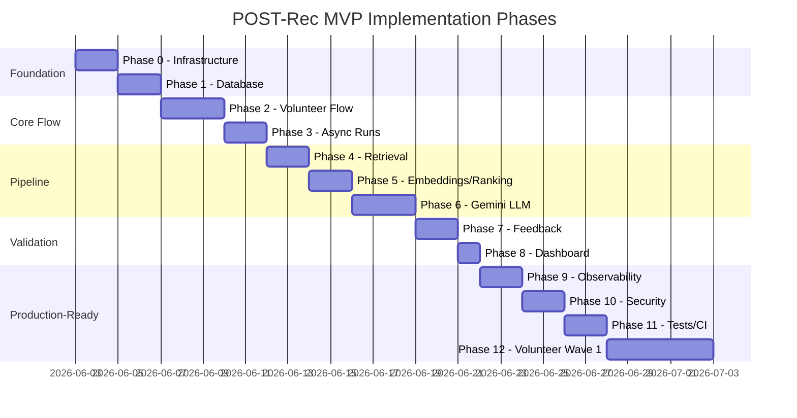

# POST-Rec Implementation Strategy

This document translates the [SDD](./POST-REC-spec-sdd.md) into an actionable implementation plan, adapted for **Google Gemini** as the LLM provider.

## Executive Summary

POST-Rec Alpha MVP is built in **13 phases (0–12)** following the SDD roadmap. The primary adaptation from the original spec is replacing OpenAI with **Google Gemini** for both text generation and embeddings.

### Gemini Adaptation Decisions

| SDD Original | Implementation |
|---|---|
| OpenAI `gpt-4.1-mini` | `gemini-2.0-flash` (structured JSON output) |
| OpenAI `text-embedding-3-small` (1536 dims) | `gemini-embedding-001` via `GEMINI_EMBEDDING_MODEL` (768 dims) |
| OpenAI SDK | `google-genai` Python SDK |
| `VECTOR(1536)` in pgvector | `VECTOR(768)` — matches Gemini embedding dimensions |
| Cost tracking per OpenAI pricing | Approximate Gemini pricing in `llm_usage` table |

Gemini supports JSON mode via `response_mime_type="application/json"`, equivalent to OpenAI Structured Outputs. Embeddings use `output_dimensionality=768` for pgvector compatibility.

---

## Phase Overview

---

## Phase 0 — Foundation ✅

**Goal:** Runnable infrastructure skeleton.

| Deliverable | Status |
|---|---|
| Repository structure per SDD §37 | ✅ |
| `pyproject.toml` with all dependencies | ✅ |
| `docker-compose.yml` (API, UI, worker, postgres, rabbitmq) | ✅ |
| FastAPI with health/readiness | ✅ |
| React web UI shell | ✅ |
| Celery + RabbitMQ wiring | ✅ |
| `.env.example` with Gemini vars | ✅ |

**Exit criteria:** `docker compose up` starts all services without errors.

---

## Phase 1 — Database & Migrations ✅

**Goal:** Full schema with pgvector.

| Deliverable | Status |
|---|---|
| SQLAlchemy models (15 tables per SDD §17) | ✅ |
| pgvector extension + `VECTOR(768)` | ✅ |
| Alembic setup + initial migration | ✅ |
| Indexes per SDD §18 | ✅ |

**Exit criteria:** Clean DB boot creates full schema.

---

## Phase 2 — Volunteer Flow ✅

**Goal:** Complete volunteer session lifecycle.

| Deliverable | Status |
|---|---|
| `POST /sessions`, `/consents`, `/profiles`, `/expectations` | ✅ |
| React web UI: Consent, Profile, Expectation pages | ✅ |
| Final survey endpoint + UI | ✅ |

**Exit criteria:** Volunteer can start and finish a session.

---

## Phase 3 — Async Runs ✅

**Goal:** Background recommendation processing.

| Deliverable | Status |
|---|---|
| `POST /recommendation-runs` | ✅ |
| Celery task `process_recommendation_run` | ✅ |
| Status/progress/events tracking | ✅ |
| Cancel endpoint | ✅ |
| React web UI Run Details page | ✅ |

**Exit criteria:** API-created run is processed by Celery worker.

---

## Phase 4 — Academic Retrieval ✅

**Goal:** Paper discovery from external sources.

| Deliverable | Status |
|---|---|
| OpenAlex integration | ✅ |
| arXiv integration | ✅ |
| Normalization + deduplication (content hash) | ✅ |
| `source_document` persistence | ✅ |

**Exit criteria:** ≥30 papers retrieved per topic.

---

## Phase 5 — Embeddings & Ranking ✅

**Goal:** Vector search and candidate scoring.

| Deliverable | Status |
|---|---|
| Gemini embedding generation | ✅ |
| `document_embedding` storage | ✅ |
| Ranking formula (SDD §24) | ✅ |
| `final_score` computation | ✅ |

**Exit criteria:** Ranked candidates with scores.

---

## Phase 6 — Gemini Structured Output ✅

**Goal:** LLM-generated research recommendations.

| Deliverable | Status |
|---|---|
| Recommendation prompt template | ✅ |
| Gemini JSON mode generation | ✅ |
| Schema validation + fallback | ✅ |
| Anti-hallucination rules (evidence-only) | ✅ |
| `llm_usage` cost tracking | ✅ |
| Dev fallback (no API key) | ✅ |

**Exit criteria:** 3–5 valid JSON recommendations per run.

---

## Phase 7 — Feedback & Events ✅

**Goal:** Validation data collection.

| Deliverable | Status |
|---|---|
| Explicit feedback (ratings + decision) | ✅ |
| EAS calculation (SDD §14) | ✅ |
| Interaction event tracking | ✅ |
| React web UI Review page | ✅ |

**Exit criteria:** User evaluates recommendations; EAS computed.

---

## Phase 8 — Validation Dashboard ✅

**Goal:** Admin visibility into MVP metrics.

| Deliverable | Status |
|---|---|
| EAS, Approval Rate, Would Use Rate | ✅ |
| Trust/Feasibility/Usefulness averages | ✅ |
| Run completion/failure rates | ✅ |
| React web UI Dashboard page | ✅ |

**Exit criteria:** Admin sees validation metrics.

---

## Phase 9 — Observability (Partial)

**Goal:** Traceability from UI to worker.

| Deliverable | Status |
|---|---|
| structlog JSON logging | ✅ |
| Required log fields (run_id, session_id, etc.) | ✅ |
| OpenTelemetry instrumentation | 🔲 Deferred |
| Grafana/Tempo/Loki/Prometheus stack | 🔲 Deferred |

**Note:** Full Grafana stack is configured in SDD but deferred to reduce MVP complexity. structlog provides sufficient observability for Wave 1.

---

## Phase 10 — Security (Partial)

**Goal:** Safe volunteer testing.

| Deliverable | Status |
|---|---|
| Secrets via environment variables | ✅ |
| CORS middleware | ✅ |
| Pydantic payload validation | ✅ |
| Consent flow | ✅ |
| Auth (JWT) | 🔲 Disabled by default (`AUTH_ENABLED=false`) |
| Rate limiting | 🔲 Deferred |
| Audit log table | ✅ (schema only) |

---

## Phase 11 — Tests & CI ✅

**Goal:** Quality gates.

| Deliverable | Status |
|---|---|
| Unit tests (EAS, ranking) | ✅ |
| Integration tests (health, sessions) | ✅ |
| GitHub Actions CI (lint + test) | ✅ |
| Ruff linting | ✅ |

**Exit criteria:** CI passes on push.

---

## Phase 12 — Volunteer Wave 1 (Operational)

**Goal:** Real user validation (3–5 volunteers).

This is an **operational phase**, not a code phase. Prerequisites from SDD §40:

- [x] Consent + expectation capture
- [x] Quick Mode runs
- [x] 3–5 recommendations per run
- [x] Feedback + final survey
- [x] Validation dashboard
- [x] Cost tracking
- [x] Health checks
- [ ] PostgreSQL backup script
- [ ] Anonymized data export script
- [ ] Set `GEMINI_API_KEY` in production `.env`

---

## Risk Register

| Risk | Mitigation |
|---|---|
| Gemini API rate limits | Celery retry policy (3 retries, exponential backoff) |
| Gemini JSON schema failures | Local repair + fallback recommendations |
| No API key in dev | Deterministic fallback generator |
| Embedding dimension mismatch | `GEMINI_EMBEDDING_DIMENSIONS=768` aligned with pgvector schema |
| OpenAlex/arXiv downtime | Graceful degradation; partial paper sets |
| Cost overrun | `MAX_COST_PER_RUN_USD=2.00` limit + `llm_usage` tracking |

---

## Next Steps After Wave 1

1. Enable full OpenTelemetry + Grafana stack (Phase 9 completion)
2. Enable JWT auth + rate limiting (Phase 10 completion)
3. Add Deep Mode (200 papers, 10 recommendations)
4. Improve ranking with learned weights from feedback
5. Add anonymized export + backup scripts
6. Proceed to Wave 2 (8–12 volunteers) if EAS ≥ 3.5
